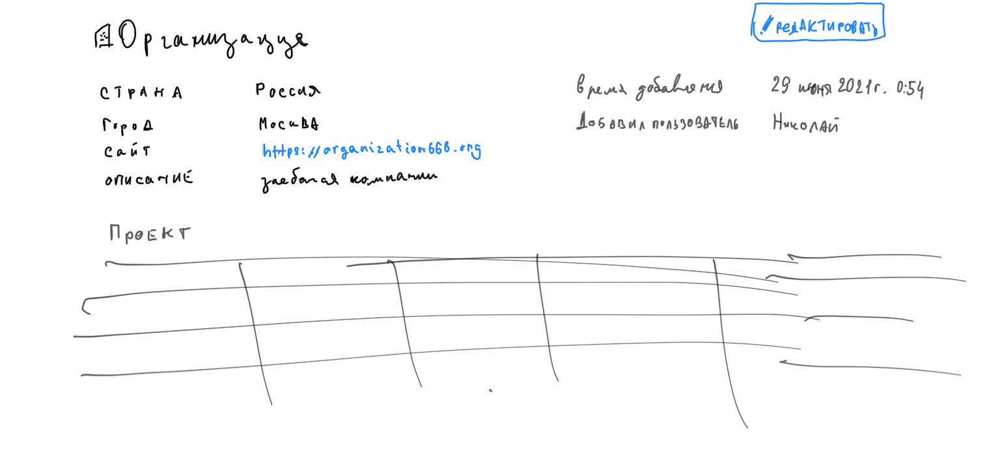

## TODO
- [x] Main page (Organizations)
    - [x] with grouping organizations by country
    - [x] search
- [x] Page with news (last added organizations)
- [x] Organization page
    - [x] Edit
    - [x] Add
- [x] Project page
    - [x] Edit
    - [x] Add
- [x] Page with all projects
    - [x] Filter
    - [x] Search
- [ ] Search
- [x] add fields. It need changing user models (add custom user model)
    - updated_at
    - updated_by
- [x] Footer to bottom

### Adding organization
- [ ] By step
    1. [ ] Add country
    2. [ ] Add city
    3. [ ] Add organization
    4. [ ] Add project
        - application_scope
        - scientist as text_field

### Edit Organization page

